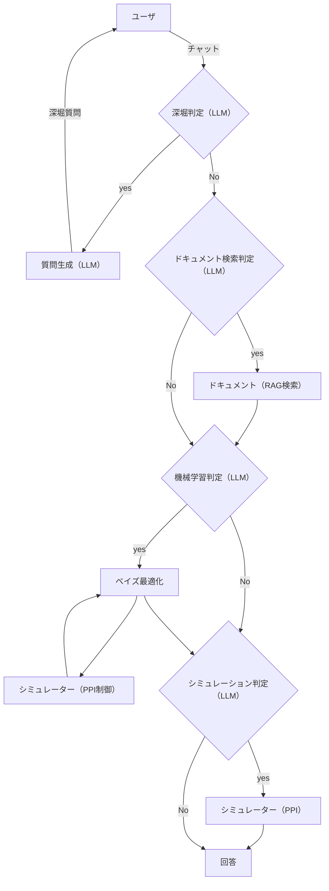

## 将来的な構想

```mermaid
graph TD;
    user[ユーザ]--チャット-->routing{深堀判定（LLM）};
    routing--yes-->ask_agent[質問生成（LLM）];
    ask_agent--深堀質問-->user;
    routing--No -->doc_agent{ドキュメント検索判定（LLM）};
    doc_agent--yes-->docment[ドキュメント（RAG検索）];
    docment[ドキュメント（RAG検索）]-->ML_agent{機械学習判定（LLM）};
    doc_agent--No -->ML_agent;
    ML_agent--yes-->ML[ベイズ最適化]-->sim_PPI[シミュレーター（PPI制御）];
    ML_agent--No -->sim_agent{シミュレーション判定（LLM）};
    sim_PPI[シミュレーター（PPI制御）]-->ML;
    ML-->sim_agent;
    sim_agent--yes -->sim_PPI_2[シミュレーター（PPI）]-->answer[回答]
    sim_agent--No -->answer[回答]

```
